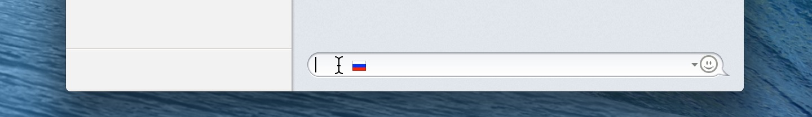

# YouType для macOS
### Может отображать текущую раскладку клавиатуры в строке состояния в виде флагов в macOS 12.4

[**Поддержать**](https://www.buymeacoffee.com/freefelt)  |  [**Обратная связь**](https://github.com/freefelt/YouType/issues/new)  |  [Обзоры / упоминания](reviews.md)  |  [Скачать](https://github.com/freefelt/YouType/raw/main/YouType.zip) |  [YouType for Windows](Windows/README-rus.md)  |  This page is also available in: [english](../..)

**YouType** это полезная программа, которая позволит тебе сохранить нервы и работать на компьютере более эффективно. При наведении курсора мыши на любое текстовое поле, YouType показывает рядом с указателем флажок текущей раскладки клавиатуры. Ты будешь видеть текущий язык как раз перед вводом текста, и в том месте экрана, куда ты смотришь в данный момент. Это очень удобно! Это позволит тебе делать меньше ошибок ввода и не терять время на исправление уже напечатанного.

Также YouType будет удобна при работе в **полноэкранном режиме**, когда индикатор текущей раскладки скрывается вместе с главной панелью. Флажок возле курсора в нужном месте подскажет какой сейчас выбран язык ввода.
