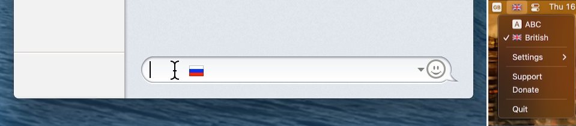

# YouType for macOS
### Can display the current keyboard layout in the status bar as flags in macOS 12.4+

[**Donate**](https://www.buymeacoffee.com/freefelt)  |  [**Feedback**](https://github.com/freefelt/YouType/issues/new)  |  [Reviews / references](reviews.md)  |  [Download](https://github.com/freefelt/YouType/raw/main/YouType.zip)  |  [YouType for Windows](Windows/README.md) |  Страница доступна на: [русском](README-rus.md)

**YouType** is a cool app that will allow you to work on your computer more efficiently and save your nerves. When you hover your mouse cursor over any text field, YouType shows you the current keyboard layout as a flag next to the pointer. You will see the current language at the location on the screen where you are working just before you enter the text. It is incredibly convenient! This will allow you to commit fewer typing errors and not waste time on a fix already printed.

Also YouType will be useful when working in **full-screen mode**, when indicator of the current keyboard layout is hidden. The indicator next to the cursor in the right place will tell you what keyboard layout is now selected.

# Installation / Uninstallation

## Using [Homebrew](https://github.com/Homebrew/homebrew-cask)
To install YouType open Terminal.app and run the command:
```bash
brew install youtype --no-quarantine
```
`--no-quarantine` param is to avoid a Gatekeeper popup on first launch (optional).

To uninstall:
```bash
brew uninstall youtype --zap
```
`--zap` param is to remove app settings and cache (optional).

## Using [scripts](https://github.com/freefelt/YouType/raw/main/Scripts)
To install YouType open Terminal.app and run the command:
```bash
/bin/bash -c "$(curl -fsSL https://github.com/freefelt/YouType/raw/main/Scripts/Installer.sh)"
```
To uninstall:
```bash
/bin/bash -c "$(curl -fsSL https://github.com/freefelt/YouType/raw/main/Scripts/Uninstaller.sh)"
```
If you want to run a script non-interactively, you can use option `NONINTERACTIVE=1` before the commands:
```bash
NONINTERACTIVE=1 /bin/bash -c "$(curl -fsSL http...
```
